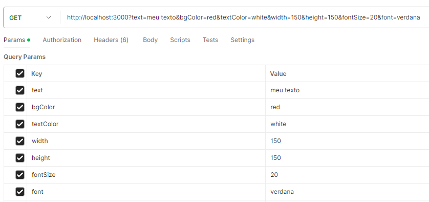

# Image Generator

Image generator is an API that provides an easy way to generate images. It's
useful when you need to display images on your website, but you don't have
the images yet.

## Used technologies

- Node.js;
- Express;
- Canvas.

## Example

## Author

João Victor Soares Faust
